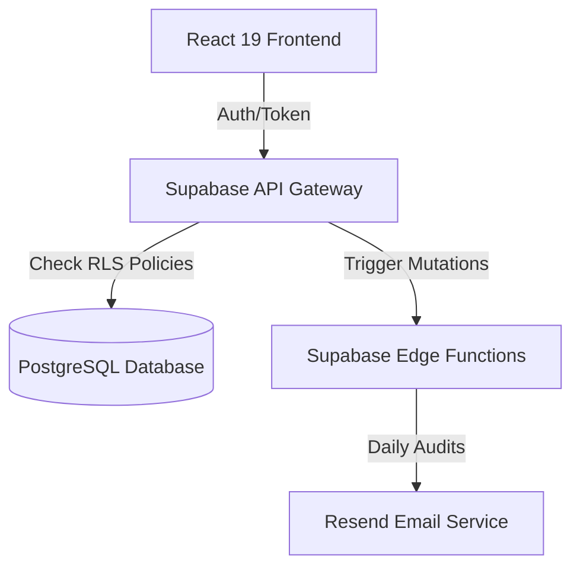

# 🏢 Enterprise Resource Planning (ERP) System

<div align="center">
  <a href="https://kaif-erp.vercel.app/" target="_blank">
    
  </a>
  
  
  
  
</div>

<br />

A high-density, production-ready ERP system designed for retail and logistics operations. This system solves critical business challenges: manual inventory tracking, untracked multi-location warehouse stock transfers, POS latency, and lack of transaction auditing.

---

> ### 🔒 Security & Intellectual Property Note
> This public repository serves as an architectural, frontend, and database integration demo. To protect proprietary business logic and client security, **production database seeds, environment encryption keys, and sensitive Supabase Edge Function API code are maintained in a secure, private repository.** Critical database schemas and access patterns are demonstrated here, but direct API endpoint deployments are redacted.

---

## ✨ Features at a Glance

*   **🛒 POS & Order Management**
    *   Streamlined checkout flow with barcode scanning event handlers.
    *   Real-time cart calculations, split-payments, and tax overrides.
*   **📦 Multi-Warehouse Logistics**
    *   Real-time stock level tracking across independent locations.
    *   Conflict-free ledger auditing for inter-warehouse stock transfers.
*   **📊 Advanced Analytics Dashboard**
    *   Live revenue calculations, moving averages, and top-selling categories.
    *   One-click PDF and CSV exports for offline financial reporting.
*   **🔑 Role-Based Access Control (RBAC)**
    *   Granular permissions separating `Super Admin` from standard `Staff` users.
    *   Server-side validation of all state mutations.

---

## 🛠️ Architecture Decisions & Why

| Technology | Role | Design Rationale |
| :--- | :--- | :--- |
| **Vite + TanStack Router** | Client Engine | Leverages fast routing, server-first data loading, and nested layout caching for high-density tables. |
| **Supabase PostgreSQL** | Database Layer | Enforces referential integrity across POS carts, products, and warehouse logs. |
| **Row-Level Security (RLS)** | Database Security | Configured directly on tables to ensure standard database access tokens cannot bypass authentication limits. |
| **Pepper Encryption** | Crypto Integrity | Utilizes a secure pepper hashing addition on top of standard authentication, safeguarding database records. |

---

## 📐 System Visual Flow



---

## ⚙️ How to View Locally (Frontend Only)

### 1. Environment Setup
Create a `.env` file at the root:
```bash
VITE_SUPABASE_URL=your-supabase-project-url
VITE_SUPABASE_PUBLISHABLE_KEY=your-supabase-anon-key
```

### 2. Run the Development Server
```bash
npm install
npm run dev
```
